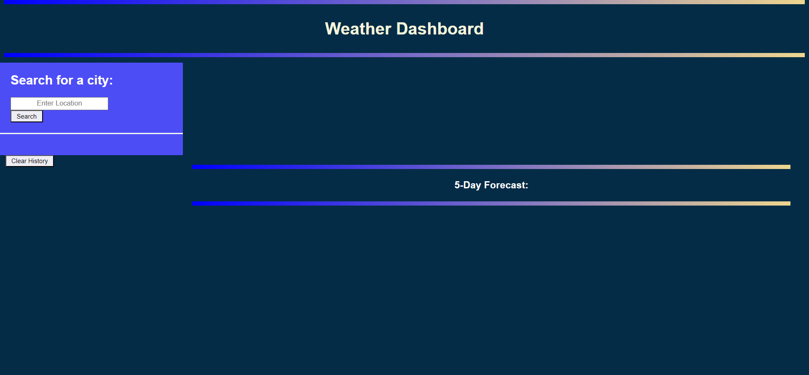
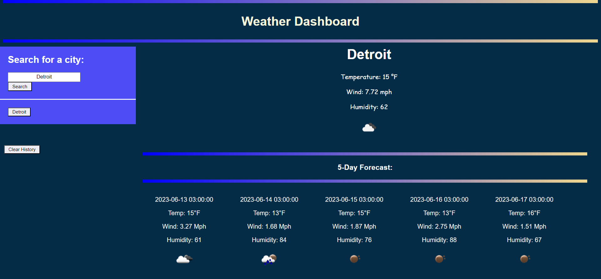

# C6-WEATHERAPP
## Main Task

Your challenge is to build a weather dashboard that will run in the browser and feature dynamically updated HTML and CSS.

## Requirements:

## User Story

```
AS A traveler
I WANT to see the weather outlook for multiple cities
SO THAT I can plan a trip accordingly
```

## Acceptance Criteria

```
GIVEN a weather dashboard with form inputs
WHEN I search for a city
THEN I am presented with current and future conditions for that city and that city is added to the search history
WHEN I view current weather conditions for that city
THEN I am presented with the city name, the date, an icon representation of weather conditions, the temperature, the humidity, and the wind speed
WHEN I view future weather conditions for that city
THEN I am presented with a 5-day forecast that displays the date, an icon representation of weather conditions, the temperature, the wind speed, and the humidity
WHEN I click on a city in the search history
THEN I am again presented with current and future conditions for that city
```
> **(Main Task, User Story and Acceptance Criteria / Challenge 6; CARL-VIRT-FSF-PT-04-2023, README.md 2023)** 

## Final Work Review

**"Always leave the code a little cleaner than when you found it."**  This action was applied to HTML, CSS and JAVASCRIPT. To create an online weather application from scratch, I used Jon Ducket's JAVASCRIPT & JQuery book, references for my style.css on Google, W3Schools, CSSPortal, Snyk and all ZOOM recordings (of previous classes). Looks much cleaner, organised and easier to find what you are looking for. Comments were added in JAVASCRIPT to show what was done and for what purpose.

> **(CARL-VIRT-FSF-PT-04-2023, Challenge 6 / README.md 2023)**
> **(JAVASCRIPT & JQUERRY, Jon Duckett, Wiley; First edition (June 30 2014) pages 14-292. )**

The following animation demonstrates the application functionality:

> **(I was not able to solve the issue in the code for displaying the correct time. I also made the application for desktops ONLY.)**

### How the Weather Dashboard looks:



### How the Weather Dashboard looks: When you enter data in a time block.



### How the Weather Dashboard looks: When you remove the data entered.


The assignment can be viewed here: [C6-WeatherApp](https://smarquis85.github.io/C6-WeatherApp/)
